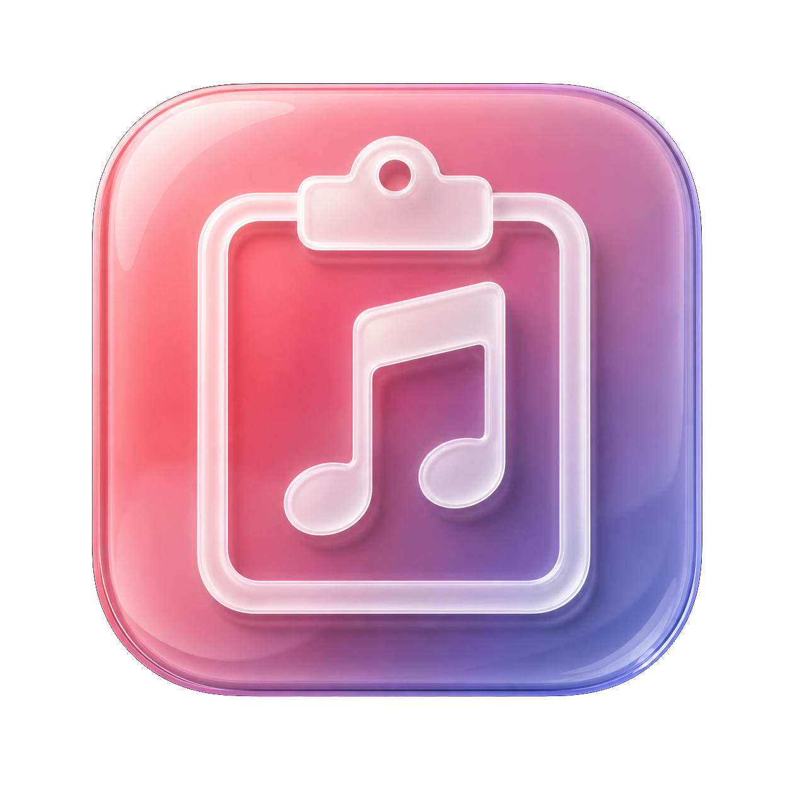
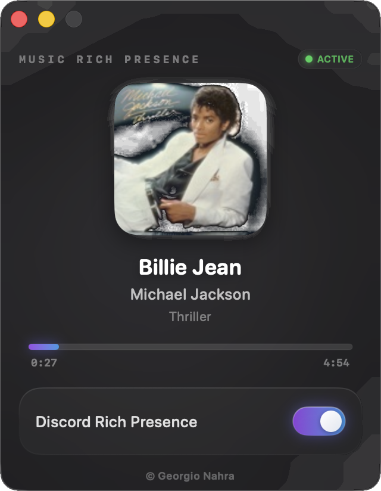
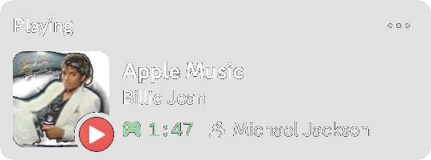

# Music Rich Presence — Apple Music Discord Rich Presence for macOS

<p align="center">
  
</p>

> 🎵 **Music Rich Presence** is a native macOS SwiftUI app that brings **Apple Music Rich Presence to Discord**.  
> It displays your currently playing Apple Music track, artist, album, artwork, and playback progress directly on your Discord profile — live, automatic, and beautifully redesigned for macOS Tahoe.

---

<p align="center">
  Developed with ❤️ by <a href="https://github.com/georgionahra">Georgio Nahra</a>
</p>

---

## 📚 Table of Contents

- [✨ Features](#features)
- [📸 Preview](#preview)
- [🔎 About](#about)
- [🧱 Tech Stack](#tech-stack)
- [🚀 Installation](#installation)
- [🛠️ Requirements](#requirements)
- [🧩 Permissions](#permissions)
- [⚠️ Troubleshooting](#troubleshooting)
- [📄 License](#license)
- [👑 Credits](#credits)

---

<a id="features"></a>
## ✨ Features

- 🎧 Displays the **current Apple Music song**, **album**, and **artist** in real time  
- 🟢 Shows your Apple Music activity directly as **Discord Rich Presence**  
- 🕒 Shows real-time **playback progress** with elapsed track time  
- 🖼️ Automatically fetches and displays **album artwork**  
- 🚫 Toggle switch to enable or disable Discord Rich Presence  
- 🔄 Auto-refreshes when tracks change or playback position is manually adjusted  
- 🔔 Checks for app updates and notifies you when a new version is available  
- 🎛️ Clean native macOS interface redesigned with a **Liquid Glass** style  
- 🌓 Liquid Glass app icon with light and dark appearances, adapting to macOS Dock dark mode  
- 🧊 Built-in alerts when Discord is not running  

---

<a id="preview"></a>
## 📸 Preview

| Interface | Discord |
|----------|---------|
|  |  |

> *Album art, song title, album name, artist, and playback progress shown in both the app and your Discord profile.*

---

<a id="about"></a>
## 🔎 About

**Music Rich Presence** is made for users who want an **Apple Music Discord Rich Presence app for macOS**.

It connects Apple Music with Discord so your profile can show what you are listening to, including the current track, artist, album, artwork, and playback progress.

This project is designed as a native macOS app built with SwiftUI, focused on a clean interface, automatic updates, update availability notifications, and a modern **Liquid Glass** visual style for macOS Tahoe.

Common use cases include:

- Showing your Apple Music status on Discord  
- Displaying Apple Music tracks as Discord Rich Presence  
- Using a native macOS Apple Music Discord status app  
- Sharing live music activity from Apple Music to Discord  

---

<a id="tech-stack"></a>
## 🧱 Tech Stack

- `SwiftUI` for the native macOS interface  
- `ScriptingBridge` to communicate with Apple Music  
- [`SwordRPC`](https://github.com/Azoy/SwordRPC) for Discord Rich Presence  
- `Socket.swift` as a dependency of SwordRPC  
- Swift 6, macOS 26+ compatible (ARM + Intel)  

---

<a id="installation"></a>
## 🚀 Installation

### 🧪 Run from Xcode

1. Clone this repository: ```git clone https://github.com/GeorgioNAHRA/MusicRichPresence```
2. Open the `.xcodeproj` in Xcode  
3. Select the "My Mac" target and press Run (⌘R)  

### 📦 Build a .app version

1. In Xcode, go to: **Product > Archive** → then export the `.app`
2. Move the `.app` to `/Applications` and launch it like a native macOS app  

---

<a id="requirements"></a>
## 🛠️ Requirements

- macOS Tahoe (26) or later  
- Apple Music app installed and running  
- Discord app installed and running  
- AppleScript permissions granted by macOS  

---

<a id="permissions"></a>
## 🧩 Permissions

When launching the app for the first time, macOS may ask for permission to control “Music”.  
Click **OK** — this permission is required to fetch the current Apple Music track information.

---

<a id="troubleshooting"></a>
## ⚠️ Troubleshooting

- ❌ *"Discord is not running"* error: Make sure the Discord app is open  
- ❌ *Rich Presence does not show*: Toggle Discord Rich Presence off/on in the app  
- ❌ *Track information does not update*: Make sure Apple Music is open and playing a track  

💡 For detailed logs: run the app from Xcode and open the debug console (⇧⌘Y).

---

<a id="license"></a>
## 📄 License

This project is licensed under the [GNU GPLv3 License](https://www.gnu.org/licenses/gpl-3.0.en.html).

---

<a id="credits"></a>
## 👑 Credits

Made with passion by Georgio Nahra  
© 2026 — All rights reserved
